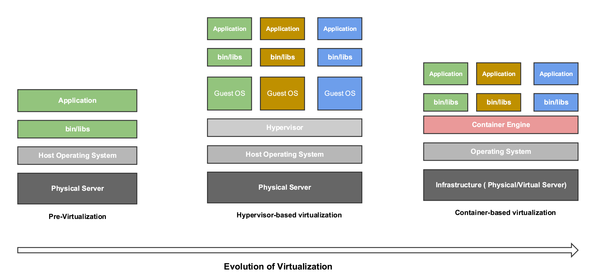

# Cloud Computing

---

## Agenda

1. Virtualization vs Containers
2. Cloud computing concepts
3. AWS + hands-on
4. Docker + hands-on
5. Infrastructure as Code + hands-on
6. Bonus: kubernetes

---

## Virtualization vs Containers

---

### Virtualization vs Containers

