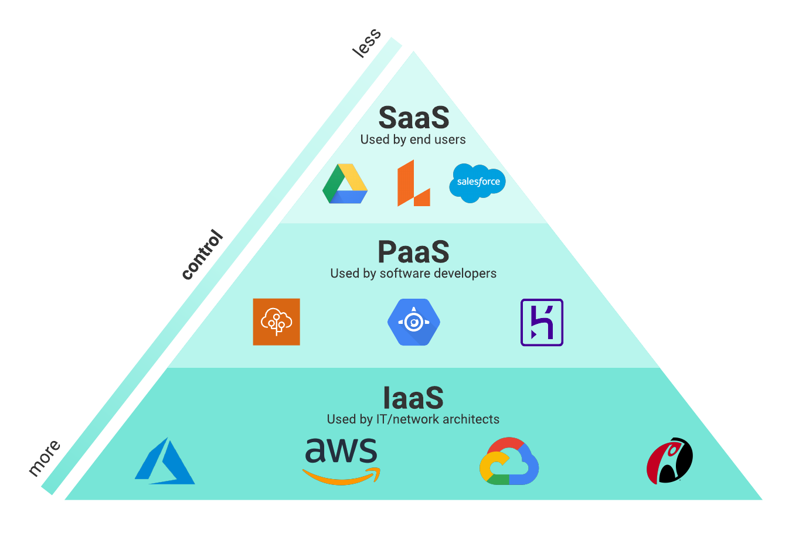

# Cloud Computing

---

## Agenda

1. Virtualization vs Containers
2. Cloud computing concepts
3. AWS + hands-on
4. Docker + hands-on
5. Infrastructure as Code + hands-on
6. Bonus: Kubernetes

---

## Virtualization vs Containers

---

### Evolution of virtualization

---

## Cloud computing

---

### Concepts

* The infrastructure is shared

* The services are accessed on demand in units that vary by service. 

* Services are scalable.

* The pricing model is by consumption. 

* Services can be accessed from anywhere in the world by multiple devices.

---

### IaaS / PaaS / SaaS

